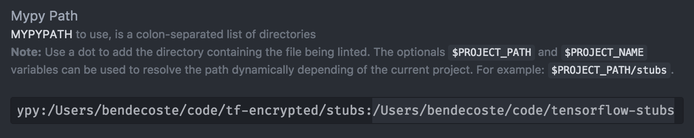
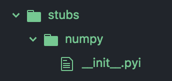
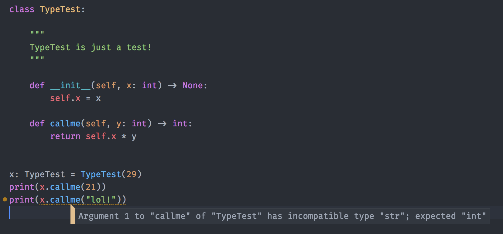
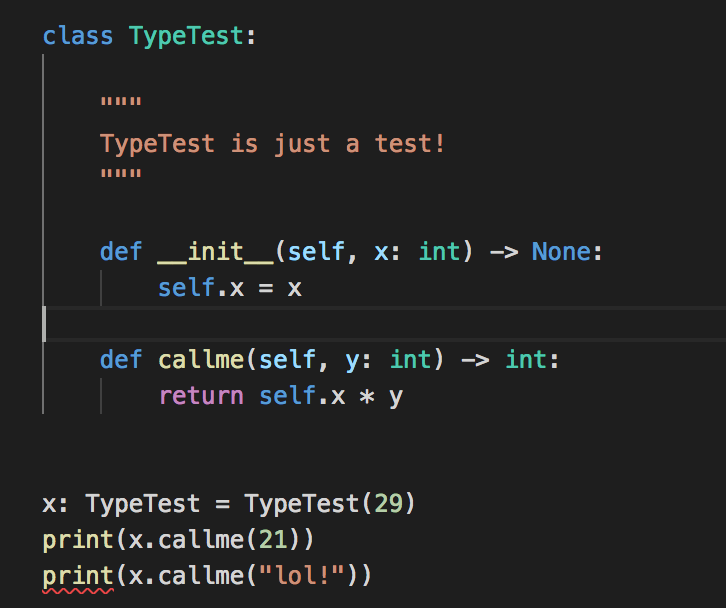

# Developing

## Documentation

This project uses [Sphinx](http://www.sphinx-doc.org/en/master/) documentation.

Whenever a change is made that impacts the behaviour of the API used by
consumers of this project the corresponding documentation should be updated so
users always have up to date documentation that reflects the true behaviour of
the library.

You can build the project locally using the `make docs` command which will
subsequently output the html version of our docs to your `build` folder. You
can view the docs after their built using your browser by running the command
`open build/html/index.html`.

## Typing

tf-encrypted is developed using types with [mypy](http://mypy-lang.org/).
This means your branch must not produce any errors when the project is run via mypy.
Most popular editors have plugins that allow you to run mypy as you develop so you
can catch problems early.


### Stubs

MyPy uses [`stubs`](http://mypy.readthedocs.io/en/latest/stubs.html#stub-files) to declare
types for external libraries.  There is a standard set of stubs declared [here](https://github.com/python/typeshed)
that should "just work" out of the box.  For external libraries that are not yet
declared in the typeshed, we can define our own or use external dependencies.


#### External

External development happens for types.  We can contribute back to these repositories
as we develop so keep that in mind whenever you need to add some annotations.

The flow to use an external library:
  - fork/clone what you want (fork optional, not necessary unless you will add types)
  - take note of the path you cloned to
  - Update the `MYPYPATH` to include this directory

E.g., for Tensorflow in Atom
  - `git clone https://github.com/partydb/tensorflow-stubs`
  - `cd tensorflow-stubs && pwd | pbcopy # => /Users/bendecoste/code/tensorflow-stubs`
  - add this path to `MYPYPATH`, in atom:
  

#### Internal

Create a new folder for the package and add a `__init__.pyi` file

E.g.,



### Atom

In Atom, you can install the [linter-mypy](https://atom.io/packages/linter-mypy) package.



### VS Code

In [User Settings](https://code.visualstudio.com/docs/getstarted/settings) add the following information

```json
{
    "python.linting.mypyEnabled": true
}
```

On OSX you may also need to tell VS Code to use python3

```json
{
    "python.pythonPath": "python3"
}
```

You also need to have mypy installed

```
python3 -m pip install mypy
```

After that, you should see errors whenever you develop (if you cause any 😉)


