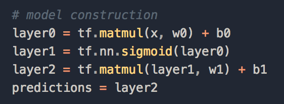
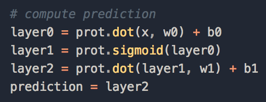
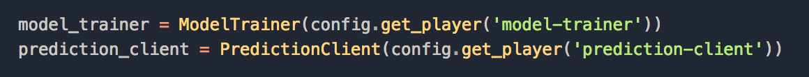
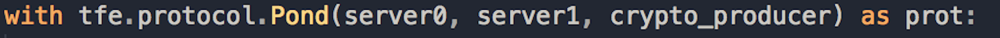
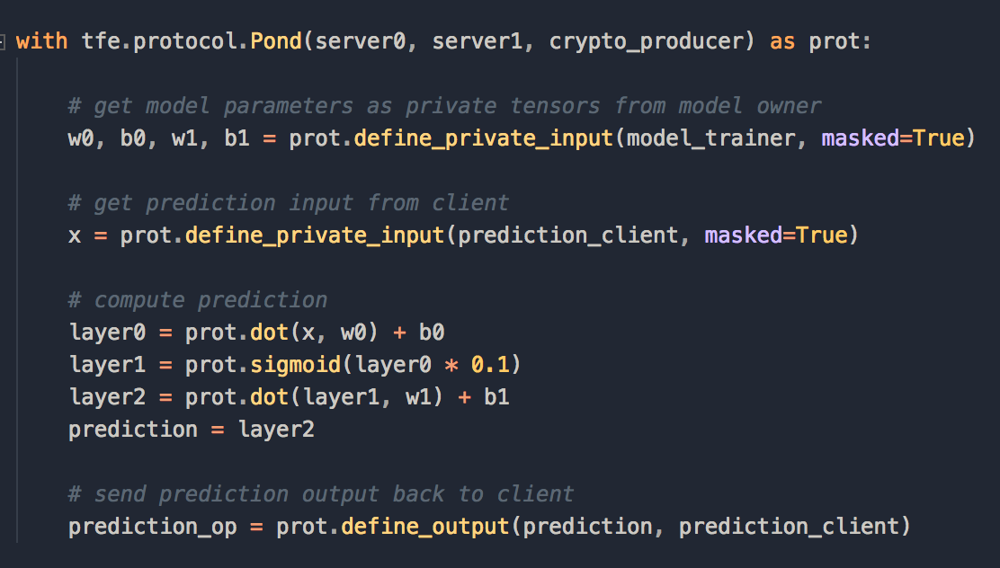

# TensorFlow Encrypted

This guide assumes that you have followed the installation instructions in [README](https://github.com/mortendahl/tf-encrypted).

- [Introduction to Tensorflow Encrypted API](#introduction-to-tensorflow-encrypted-api)
- [Make private prediction](#make-private-prediction)
  - [Locally](#locally)
  - [With GCP](#with-gcp)
- [Make private training](#make-private-training)

## Introduction to TensorFlow Encrypted API

tf-encrypted has a simple api to make it easy for data scientists to make private predictions and training.

To define a machine learning model, tf-encrypted and TensorFlow follow a very similar API.

TensorFlow             |  TensorFlow Encrypted
:-------------------------:|:-------------------------:
  |  

To make private predictions and training, we have to define a ModelTrainer and a PredictionClient. The ModelTrainer is responsible to train the model then provides the encrypted weights. The PredictionClient will provide the private input that will be used to make a private prediction.

We indicate tf-encrypted to perform secure computation with the Pond protocol as follow:

Finally we can make a prediction as follow:

Two servers and a crypto producer are doing the actual computation on encrypted data, with only the client being able to decrypt the final result.

## Make Private Prediction
### a. Locally

With Tensorflow Encrypted, you can very easily make private predictions with a pre-trained model saved as a [protobuf](https://www.tensorflow.org/extend/tool_developers/) file.

1. Run the following line of code in your terminal to train a convolution network on MNIST dataset then save the model as protobuf file : `python3 examples/mnist_cnn.py`. If you prefer to skip this step, we have saved the trained model here: `examples/test_data/FourLayerCNN_tensorflow.pb`.

2. Make private prediction on an mnist input by running the following code snippet: `./bin/run examples/test_data/FourLayerCNN_tensorflow.pb examples/test_data/mnist_input_batch100.npy`

You should see the following output. You have just made a prediction without revealing anything about the input!

### b. GCP

[NOTE] It would be great to have an example as above with GCP where we import a protobuf file and run a prediction.

You can make private prediction with GCP as well. You can find a great example [here](https://github.com/mortendahl/tf-encrypted/tree/master/examples/mnist#remotely-on-gcp).

## Make Private Training

[NOTE] We are currently don't have an example. We are planning to train/create a simple logistic regression during the hackathon.
