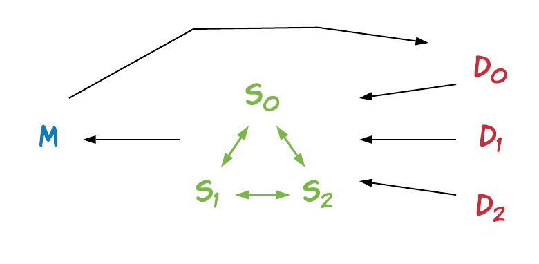
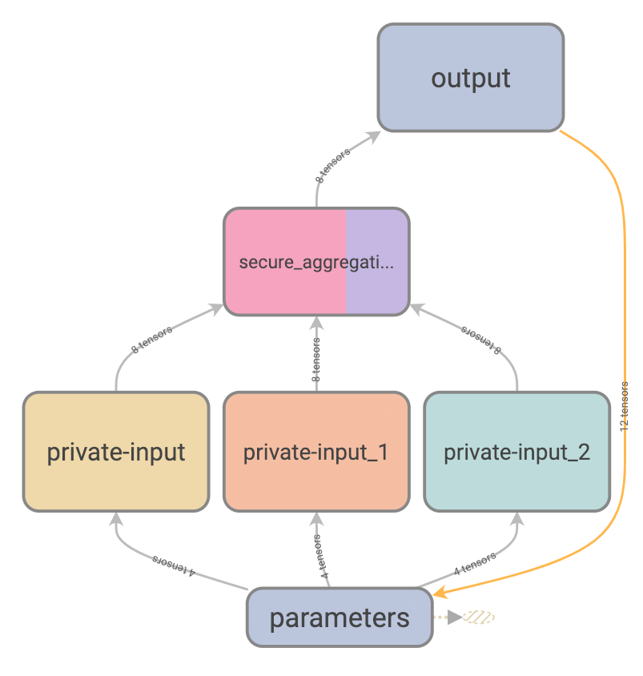
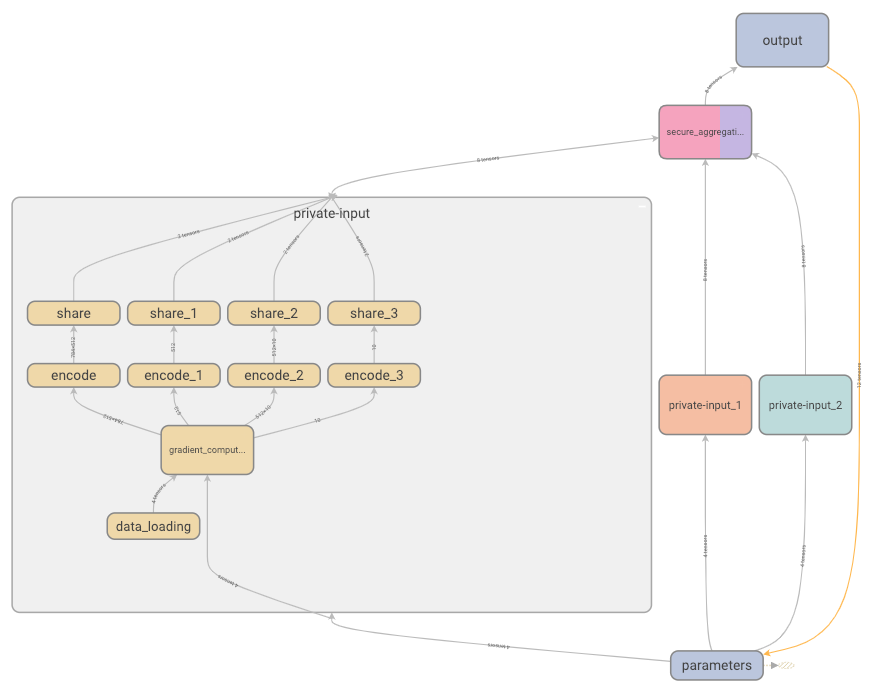

# Secure Aggregation for Federated Learning

This example shows how TF Encrypted can be used to perform secure aggregation for federated learning, where a *model owner* is training a model by repeatedly asking a set of *data owners* to compute gradients on their locally held data set. As a way of reducing the privacy leakage, only the mean gradient is revealed to the model owner in each iteration.

<p align="center"></p>

## Computation

The above players are represented via two classes, `ModelOwner` and `DataOwner`, and linked together as follows:

```python
# instantiate the model owner with owner name, model name and dataset name
model_owner = ModelOwner('model-owner', "network_a", "Mnist")

# instantiate data owners with owner name, model name, dataset name
# and specify using which part of this dataset by slice
data_owners = [
    DataOwner('data-owner-0', "network_a", "Mnist", slice(0, 20000)),
    DataOwner('data-owner-1', "network_a", "Mnist", slice(20000, 40000)),
    DataOwner('data-owner-2', "network_a", "Mnist", slice(40000, 60000)),
]
```

Then, the result of `compute_gradient` of each data owner is used as a private input into a secure computation, in this case between three *compute servers* as needed by the default ABY3 protocol.

```python
@tfe.function
def federated_training(model_owner, data_owners):
    # share model owner's model weights to data owners
    update_weights = model_owner.share_weights()
    for data_owner in data_owners:
        data_owner.update_model(*update_weights)
    # collect encrypted gradients from data owners
    model_grads = zip(*(data_owner.compute_gradient() for data_owner in data_owners))
    # compute mean of gradients (without decrypting)
    with tf.name_scope("secure_aggregation"):
        aggregated_model_grads = [
            tfe.add_n(grads) / len(grads) 
            for grads in model_grads
        ]
    # send the encrypted aggregated gradients to the model owner for it to decrypt and update
    model_owner.update_model(*aggregated_model_grads)
```

Finally, we simply run the update procedure for a certain number of iterations:

```python
for e in range(args.epochs):
    for i in range(data_owners[0].iterations):
        federated_training(model_owner, data_owners)
    model_owner.validate_model()
```

The data flow graph generated by the above can be seen below, where each colour represents a different player, with blue for instance being the model owner.

<p align="center"></p>

And by opening the private input blocks we can take a closer look at what happens locally on each data owner, in this case data loading, gradient computation, and secret sharing. Note how the gradient computation takes the current set of parameters from the model owner as input.

<p align="center"></p>


## Running

Start the federated training with the startup script `run-remote.sh`,
and you must explicitly specify which model to train and which dataset to use

```sh
./examples/application/federated-learning/run-remote.sh network_a Mnist
```

You can also specify how many epochs to run, which tfe protocol to use and which remote config file to use

```sh
./examples/application/federated-learning/run-remote.sh network_a Mnist --epochs 10 --protocol ABY3 --config config.json
```

By default, training uses 64 bits for secret sharing, this gives enough precision in most cases.
We also give a option to use 128 bits for secret sharing by setting `--precision high`,
this will give you more precision, but at a cost of more computation time.

```sh
./examples/benchmark/aby3_profile/run-remote.sh network_a Mnist --precision high
```
