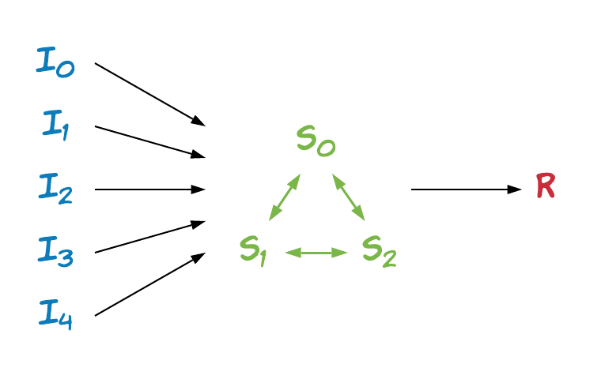

# Simple Average

As a simple starting point, this example illustrates how TF Encrypted can be used to securely compute the average of inputs from a set of input providers.

The set of players consists of five *inputters*, a *result receiver*, and the three *compute servers* needed by the default ABY3 protocol. The flow between them is as illustrated below, where encrypted inputs are sent to the compute servers calculating an encrypted average that is finally sent to the result receiver and decrypted:

<p align="center"></p>


## Computation

For this simple example the inputs are simply random tensors of a pre-specified shape, computed locally by each inputter using the following function:

```python
def provide_input() -> tf.Tensor:
    return tf.random_normal(shape=(10,))
```

These values are then brought into the secure computation using `tfe.define_private_input`:

```python
inputs = [
    tfe.define_private_input('inputter-0', provide_input),
    tfe.define_private_input('inputter-1', provide_input),
    tfe.define_private_input('inputter-2', provide_input),
    tfe.define_private_input('inputter-3', provide_input),
    tfe.define_private_input('inputter-4', provide_input)
]
```

Here, all values in `inputs` are encrypted tensors that we next tell the compute servers to calculate the average of using:

```python
result = tfe.add_n(inputs) / len(inputs)
```

and resulting in another encrypted tensor `result`.

Similarly to what we did for the inputs we define a function to be run locally on the result receiver after decryption has taken place:

```python
def receive_output(average: tf.Tensor) -> tf.Operation:
    return tf.print("Average:", average)

```

## Running

The example may be run using either an insecure local configuration, using different threads for the players:

```sh
python examples/simple-average/run.py
```

or remotely using different network hosts for the players as defined in a `config.json` configuration file:

```sh
./run-remote.sh --config config.json
```

See the [documentation](/docs/RUNNING.md) for more details.
