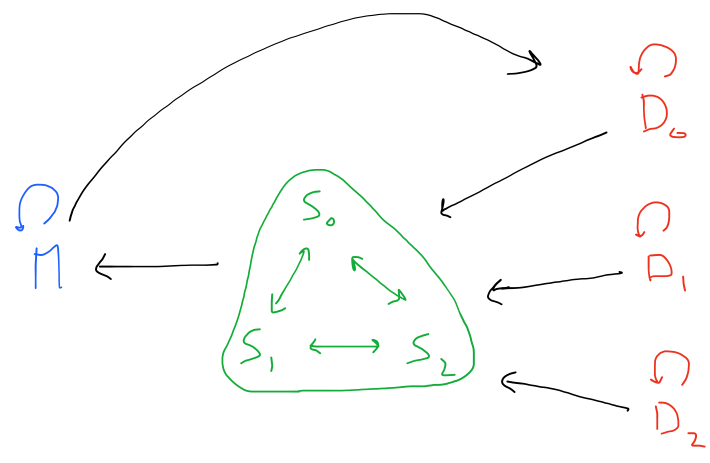

# Secure Aggregation for Federated Learning

This example shows how TF Encrypted can be used to perform secure aggregation for federated learning, where a *model owner* is training a model by repeatedly asking a set of *data owners* to compute gradients on their locally held data set. As a way of reducing the privacy leakage, only the mean gradient is revealed to the model owner in each iteration.

<p align="center"></p>

## Computation

TODO

## Running

Make sure to have the training and test data sets downloaded before running the example:

```sh
python3 examples/federated-learning/download.py
```

which will place the converted files in the `./data` subdirectory

To then run locally use:

```sh
python3 examples/federated-learning/run.py
```

or remotely using:

```sh
python3 examples/federated-learning/run.py --remote-config config.json
```

There are other configuration flags, please explore them with:

```sh
python3 examples/federated-learning/run.py --help
```

See more details in the [documentation](/docs/RUNNING.md).
