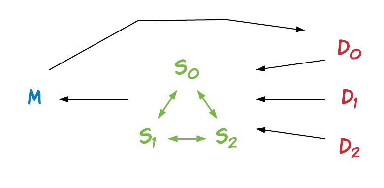

# Secure Aggregation for Federated Learning

This example shows how TF Encrypted can be used to perform secure aggregation for federated learning, where a *model owner* is training a model by repeatedly asking a set of *data owners* to compute gradients on their locally held data set. As a way of reducing the privacy leakage, only the mean gradient is revealed to the model owner in each iteration.

<p align="center"></p>

## Running

To then run locally use:

```sh
python3 examples/federated-learning/main.py
```

or remotely using:

```sh
python3 examples/federated-learning/main.py --remote-config config.json
```

These examples with automatically download the required data and then launch the training process.

There are some tweaks that be made. These can be explored with:

```sh
python3 examples/federated-learning/main.py --help
```

See more details about how to run with remote configration in the [documentation](/docs/RUNNING.md).
