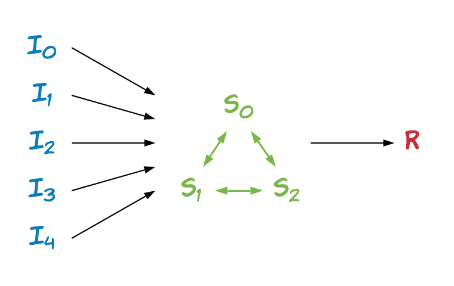

# Simple Average

As a simple starting point, this example illustrates how TF Encrypted can be used to securely compute the average of inputs from a set of input providers.

The set of players consists of five *inputters*, a *result receiver*, and the three *compute servers* needed by the default Pond protocol. The flow between them is as illustrated below, where encrypted inputs are sent to the compute servers calculating an encrypted average that is finally sent to the result receiver and decrypted:

<p align="center"></p>

Note that the involved players can also be determined by simply running the example using the default `LocalConfig`:

```sh
python examples/simple-average/run.py
```

and looking in the log:

```sh
INFO:tf_encrypted:Players: ['server0', 'server1', 'server2', 'inputter-0', 'inputter-1', 'inputter-2', 'inputter-3', 'inputter-4', 'result-receiver']
```

## Computation

For this simple example the inputs are simply random tensors of a pre-specified shape, computed locally by each inputter using the following function:

```python
def provide_input() -> tf.Tensor:
    return tf.random_normal(shape=(10,))
```

These values are then brought into the secure computation using `tfe.define_private_input`:

```python
inputs = [
    tfe.define_private_input('inputter-0', provide_input),
    tfe.define_private_input('inputter-1', provide_input),
    tfe.define_private_input('inputter-2', provide_input),
    tfe.define_private_input('inputter-3', provide_input),
    tfe.define_private_input('inputter-4', provide_input)
]
```

Here, all values in `inputs` are encrypted tensors that we next tell the compute servers to calculate the average of using:

```python
result = tfe.add_n(inputs) / len(inputs)
```

and resulting in another encrypted tensor `result`.

Similarly to what we did for the inputs we define a function to be run locally on the result receiver after decryption has taken place:

```python
def receive_output(average: tf.Tensor) -> tf.Operation:
    return tf.print("Average:", average)

result_op = tfe.define_output('result-receiver', result, receive_output)
```

Finally, to run the computation we follow the normal TensorFlow pattern of creating and using a session:

```python
with tfe.Session() as sess:
    sess.run(result_op)
```

Note that we are using `tfe.Session` here instead of `tf.Session`.

## Running

As noted earlier, the default configuration is a `LocalConfig` which serves as a convenient way of testing computations by running everything locally, using different threads for each player:

```sh
python examples/simple-average/run.pu
```

To use separate machines for each player instead we simply specify and distribute a hostmap configuration file, mapping player names to IP endpoints, and launch a TensorFlow server on each machine.

Concretely, we first create a `config.json` file, say:

```json
{
    "server0": "10.0.0.10:4440",
    "server1": "10.0.0.11:4440",
    "server2": "10.0.0.12:4440",
    "inputter-0": "10.0.0.20:4440",
    "inputter-1": "10.0.0.21:4440",
    "inputter-2": "10.0.0.22:4440",
    "inputter-3": "10.0.0.23:4440",
    "inputter-4": "10.0.0.24:4440",
    "result-receiver": "10.0.0.30:4440"
}
```

reflecting our network setup. Note that all machines must be able to talk to each other.

We then distribute this file to each machine with TensorFlow and TF Encrypted pre-installed, and launch a server by passing in the name of the player operating that particular machine:

```sh
python -m tf_encrypted.player <name> --config config.json
```

Finally we run the example:

```sh
python examples/simple-average/run.py config.json
```

Note that running the script can be done on any machine, including one that is not listed in the hostmap: it will just need access to the endpoint of the first player, as this machine is used for coordinating the computation. As a side note, it is occasionally convenient to use a dedicated `master` machine for this, which will have to be the first entry in the configuration.
